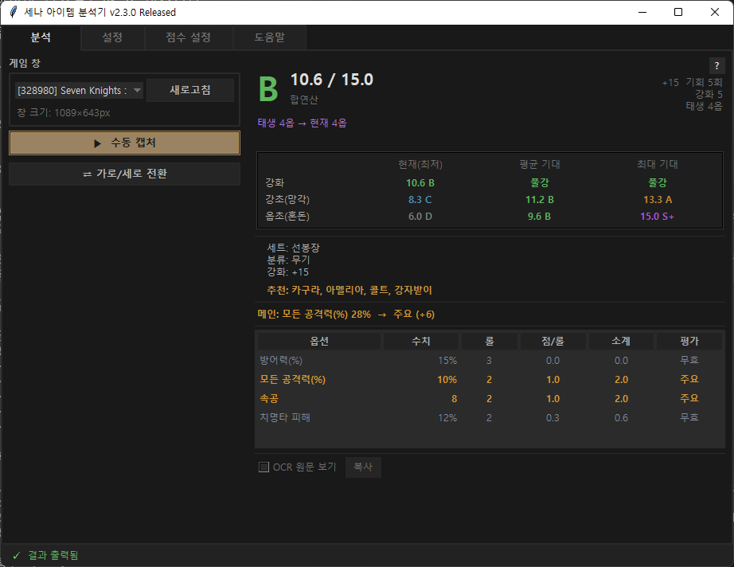
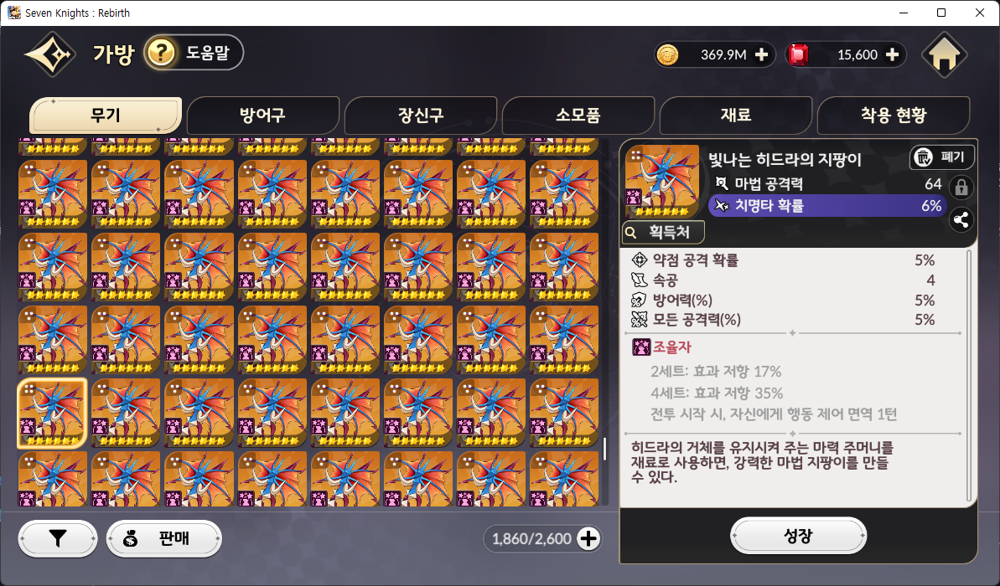
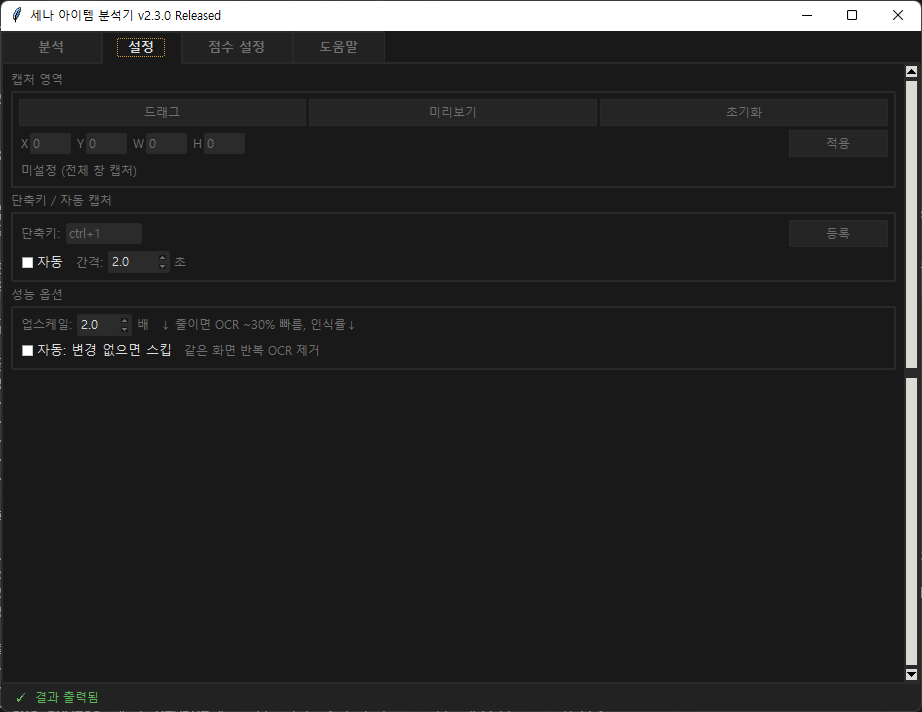
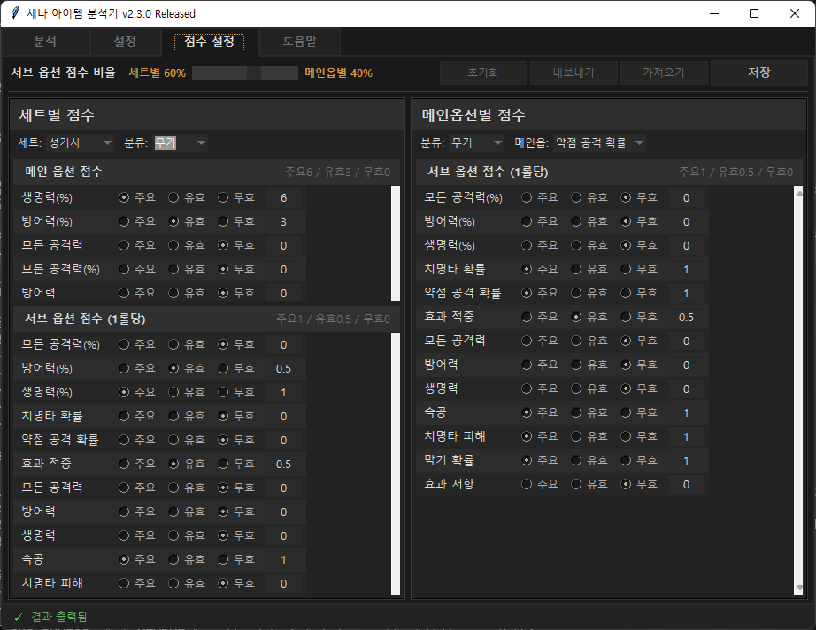

# 세나 아이템 분석기 (Rebirth Item Analyzer)

세븐나이츠 리버스 장비 아이템을 **화면 캡처 + OCR**로 인식하여 자동으로 점수를 매겨주는 Windows 데스크톱 도구.

> 게임 메모리 접근/패킷 조작/인젝션 **없음**. 화면 캡처 + Windows 내장 OCR(winocr)만 사용합니다.

## 다운로드

**[⬇ 최신 버전 다운로드 (v2.4.8)](https://github.com/flyup82/Rebirth-Item-Analyzer-public/releases/latest)**

| 파일 | 크기 | SHA256 |
|---|---|---|
| `SenaItemAnalyzer.exe` | 약 27 MB | `ce03486faddea35d15fa911576f2eecb3ad78f961110da9ba4b43c2712757893` |

백신 오탐(false positive)이 나면 위 해시로 파일 무결성을 확인하시기 바랍니다.

## 시스템 요구사항

- Windows 10 / 11 (Windows 내장 OCR 필수)
- 화면 해상도 1920×1080 권장
- 별도 설치/의존성 없음 (단일 exe)

## 빠른 시작

1. 세븐나이츠 리버스 실행 → **가방 > 무기/방어구 탭**에서 아이템을 클릭해 우측 상세창이 뜬 상태로 둡니다.

   

2. `SenaItemAnalyzer.exe` 실행.
3. 좌측 상단 **게임 창** 드롭다운에서 `Seven Knights ...` 선택.
4. **수동 캡처** 버튼 클릭 (또는 기본 단축키 `Ctrl+1`).
5. 우측 패널에 자동으로 점수/등급/주옵션/부옵션 분석 결과가 표시됩니다.

## 주요 기능

### 1. 자동 점수 산정
- 세트별 / 메인옵션별 가중치 기반 점수 계산
- 등급 분류: **S+ / S / A / B / C / D / F**
- 강초(망각) / 옵초(혼돈) 기대값 3종 시나리오 표시 (현재 / 평균 / 최대)

### 2. 탭 구성
| 탭 | 설명 |
|---|---|
| 분석 | 캡처 & 결과 확인 (메인 화면) |
| 설정 | 캡처 영역, 단축키, 성능 옵션 |
| 점수 설정 | 세트/메인옵별 점수 규칙 직접 편집 |
| 도움말 | 사용법 안내 |

### 3. 점수 규칙 커스터마이징
세트별 / 메인옵션별 **주요 / 유효 / 무효** 설정 가능. 자신만의 점수 규칙을 JSON으로 내보내기/가져오기 지원.

### 4. 고정확도 OCR
- Windows 내장 OCR(winocr) 2x 업스케일 + 대비/샤프닝 전처리
- 한국어 오인식 3단계 보정 (글자 → 기호 → 세트명)
- 내부 회귀 테스트셋 기준 **인식 정확도 99.7% 이상** (1,477장 중 완벽 일치 1,472장)

## 자주 묻는 질문

**Q. 계정 정지 위험이 있나요?**
A. 게임 프로세스에 직접 접근하지 않고, Windows가 캡처한 화면 이미지를 읽어 OCR을 수행합니다. 원리상 스크린샷을 찍어 사람이 분석하는 것과 동일합니다. 다만 본인 책임 하에 사용하시기 바랍니다.

**Q. 왜 인식이 안 되나요?**
A. 다음을 확인해 주세요:
- 게임 창이 다른 창에 가려져 있지 않은지
- **설정 탭 > 업스케일** 값을 2.0 이상으로
- 아이템 상세창이 **완전히** 표시된 상태에서 캡처했는지
- 게임 해상도가 너무 낮지 않은지 (1080p 권장)

**Q. 배치(일괄) 분석 기능은 없나요?**
A. 내부 개발 중이며 이번 공개 빌드에서는 비활성화되어 있습니다. 추후 안정화 후 공개 예정.

**Q. 백신이 위험 파일로 표시합니다.**
A. PyInstaller로 패키징된 Python exe는 휴리스틱 오탐이 잦습니다. 상단 SHA256 해시로 무결성을 확인하신 뒤 예외 처리하시기 바랍니다.

## 버전 히스토리

[CHANGELOG.md](CHANGELOG.md) 참조.

## 라이선스 및 고지

- 본 프로그램은 **바이너리 형태로만** 배포되며, 소스 코드는 공개되지 않습니다.
- 개인 사용 목적에 한해 자유롭게 사용 가능. 재배포 / 역컴파일 / 상업적 이용 금지.
- 본 프로그램은 Netmarble / Netmarble F&C 와 공식적으로 연관이 없는 비공식 도구입니다.
- 사용 중 발생하는 모든 문제에 대한 책임은 사용자 본인에게 있습니다.

## 문의 / 버그 제보

[Issues](https://github.com/flyup82/Rebirth-Item-Analyzer-public/issues) 탭을 이용해 주세요. 이슈 등록 시 다음을 포함해 주시면 빠른 대응이 가능합니다:
- 프로그램 버전
- 게임 해상도 / Windows 버전
- OCR 원문 (분석 화면의 **OCR 원문 보기** 체크 후 **복사** 버튼)
- 가능하면 문제 발생 시점의 게임 스크린샷
